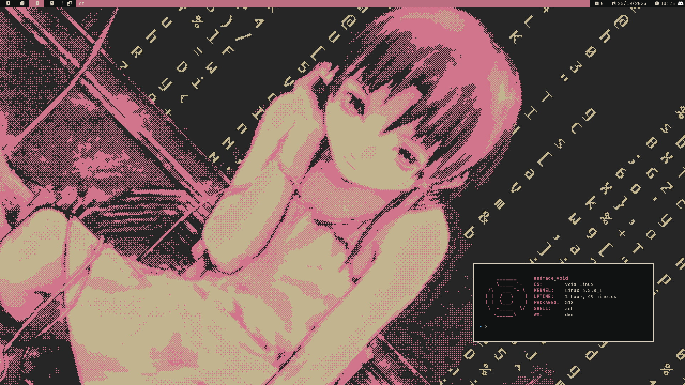

<h1 align="center"> My Personal Files! </h1>

  
 

<h2> Installation Guide </h2>
1 - Update do xbps e da iso
2 - Particionar (lembrar de setar como mbr e setar flag bootavel na particao de boot)
3 - Formatar particoes como btrfs
4 - Montar particoes em mnt
5 - Instalar xbps, setar repositorio, arquitetura e instalar base-voidstrap base-devel linux runit
6 - Entrar como xchroot
7 - Editar rc.conf e gerar locales
8 - Senha do root
9 - Fstab
10 - Grub
11 - Ativar servico dhcpcd
12 - Criar usuario e adicionar ao grupo wheel
13 - Instalar repositorios extras
14 - Trocar para os mirros de Chicago
15 - Instalar os pacotes xorg-server xinit xinput xsetroot xsel xf86-input-evdev
16 - Apos xorg, instalar o driver da nvidia
17 - Instalar nerd fonts e dependecias do dwm (ja que minha compilacao do dwm usa ela, entao e necessaria)
18 - Instalar o git
19 - Instalar e iniciar servico dbus
